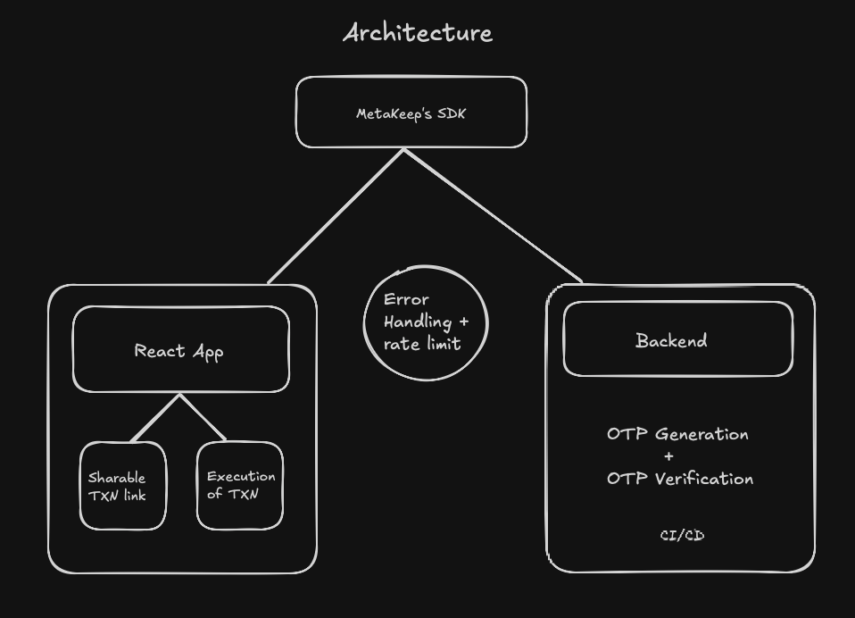
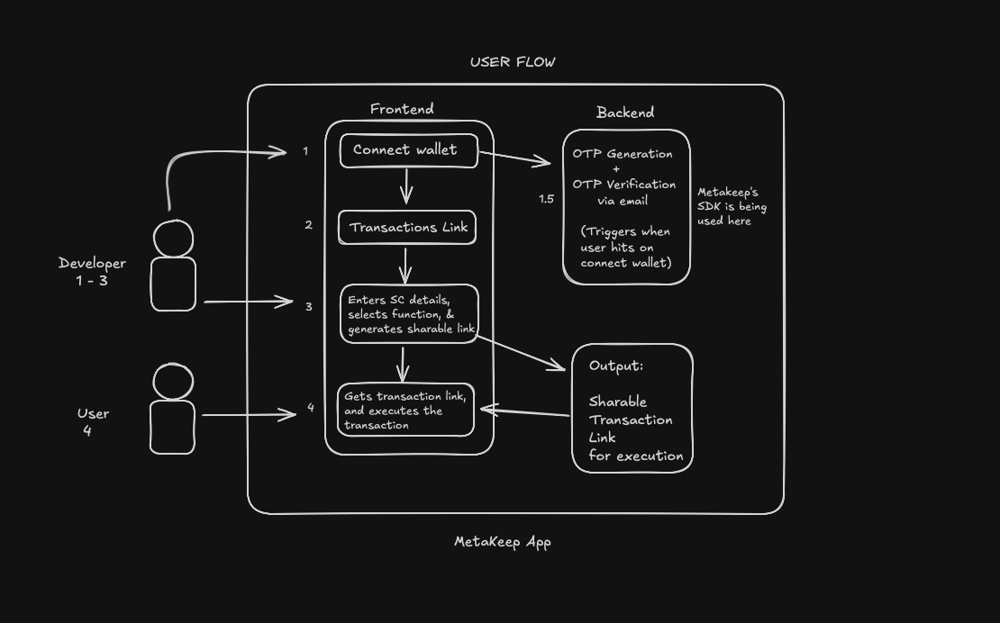

## Demo Testing of the project: 

For Contract address use: 0x2791Bca1f2de4661ED88A30C99A7a9449Aa84174 

For Contract ABI use: [
  {
    "constant": false,
    "inputs": [
      {"name": "spender", "type": "address"},
      {"name": "amount", "type": "uint256"}
    ],
    "name": "approve",
    "outputs": [{"name": "", "type": "bool"}],
    "payable": false,
    "stateMutability": "nonpayable",
    "type": "function"
  },
  {
    "constant": true,
    "inputs": [{"name": "account", "type": "address"}],
    "name": "balanceOf",
    "outputs": [{"name": "", "type": "uint256"}],
    "payable": false,
    "stateMutability": "view",
    "type": "function"
  },
  {
    "constant": false,
    "inputs": [
      {"name": "recipient", "type": "address"},
      {"name": "amount", "type": "uint256"}
    ],
    "name": "transfer",
    "outputs": [{"name": "", "type": "bool"}],
    "payable": false,
    "stateMutability": "nonpayable",
    "type": "function"
  }
]

Select Function as Transfer: 

* Recipient: 0x0000000000000000000000000000000000000000 (or any valid address)
* Amount: 1000000 (USDC has 6 decimals, so this is 1 USDC)
* Add a description like "Test USDC Transfer"
* Click on the generate link and you are good to go! (if you are on a local host otherwise aws OTP verification will fail for some unknown reason)

## Architecture Diagram

## User Flow

As a developer I want to generate a TXN link for users

As a user, I want to execute the TXN that was sent by the developer

### AWS link:

http://metakeep-assignment.s3-website.eu-north-1.amazonaws.com

Please note: Otp verification is likely to fail on this server. To use this project to full potential, please clone this repo on your local machine

## Project Setup

Clone the project by running the command

        https://github.com/meetjn/Transaction-link-generator.git

Run the command

        npm install

        npm start

Please make sure to create a .env file as shown in .env.example file and get its credentials correctly

The project should start at localhost:3000

